# Penugasan Module 1

| Name           | NRP        |
| ---            | ---        |
| Nabil Irawan | 5025241231 |

## API

  `http://157.15.40.36/health`

## Poin 1

> Buatlah API publik dengan endpoint /health yang menampilkan informasi sebagai berikut:
CONTOH (value disesuaikan)
{
  "nama": "Sersan Mirai Afrizal",
  "nrp": "5025241999",
  "status": "UP",
  “timestamp”: time	// Current time
  "uptime": time		// Server uptime
}
Bahasa pemrograman dan teknologi yang digunakan dibebaskan kepada peserta.

**Answer:**

- Screenshot

  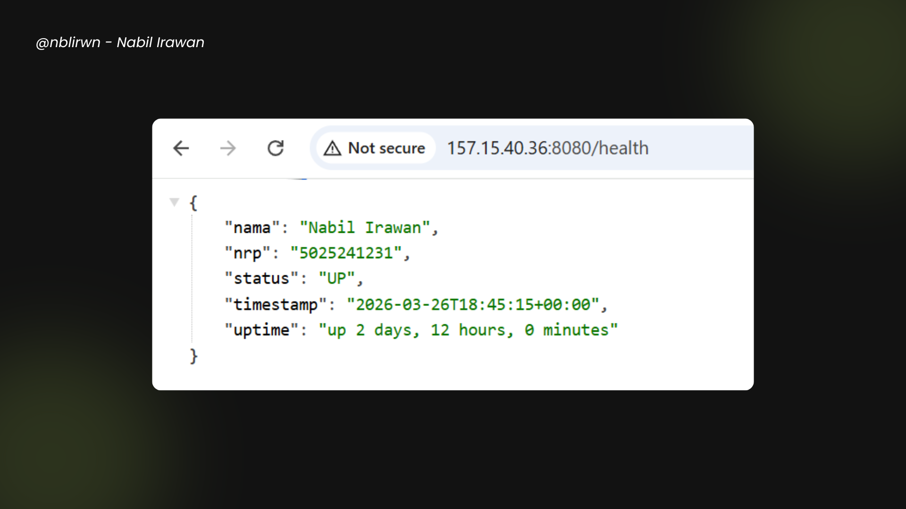

- Explanation

  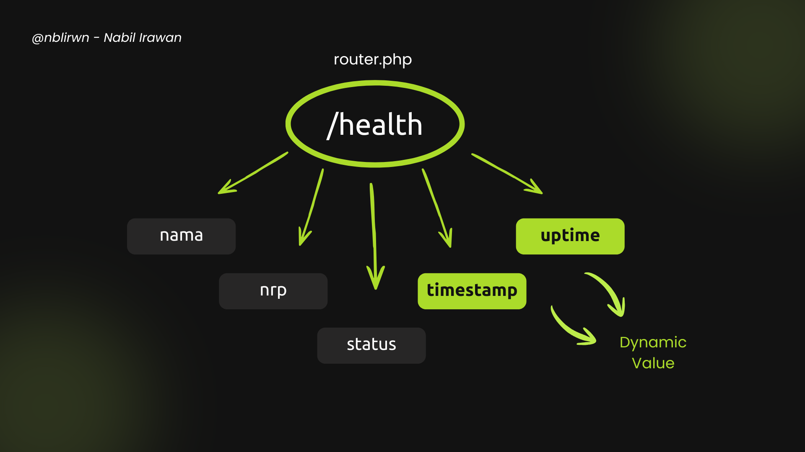

  Dir: `api/`

  Pada poin 1 diminta untuk membuat endpoint /health yang memberikan response dengan content-type `application/json` dengan beberapa field. Di poin ini saya memutuskan untuk menggunakan bahasa pemrograman PHP. Untuk field `nama`, `nrp`, `status` bersifat static, sedangkan field `timestamp` dan `uptime` bersifat dynamic. Selain itu juga terdapat handler untuk mengatasi kondisi ketika client mengakses endpoint yang tidak ada pada server dengan memberikan response `Endpoint Not Found`.

- Reference
  - http://stackoverflow.com/questions/20620300/http-content-type-header-and-json
  - https://stackoverflow.com/questions/38907572/how-to-display-system-uptime-in-php
  - https://gemini.google.com/share/3303a4dbb6aa

<br>

## Poin 2

> Lakukan deployment API tersebut di dalam container pada VPS publik. Gunakan port selain 80 dan 443 untuk menjalankan API.

**Answer:**

- Screenshot

  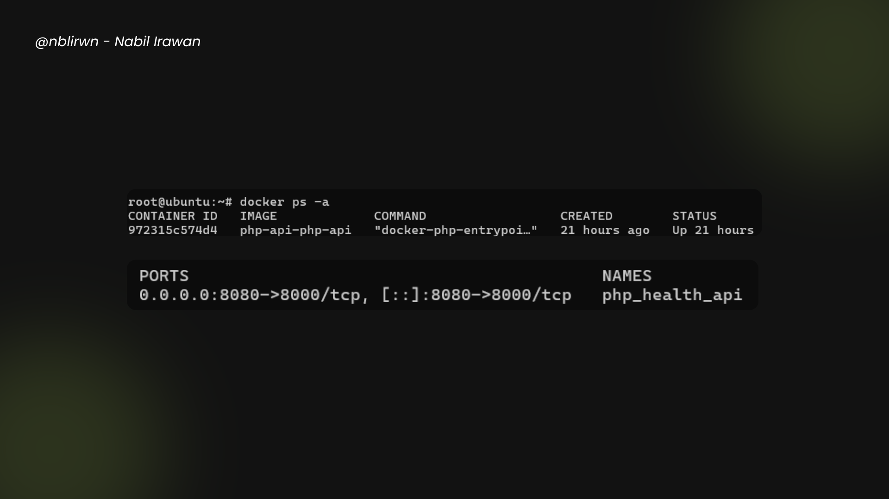

- Explanation

  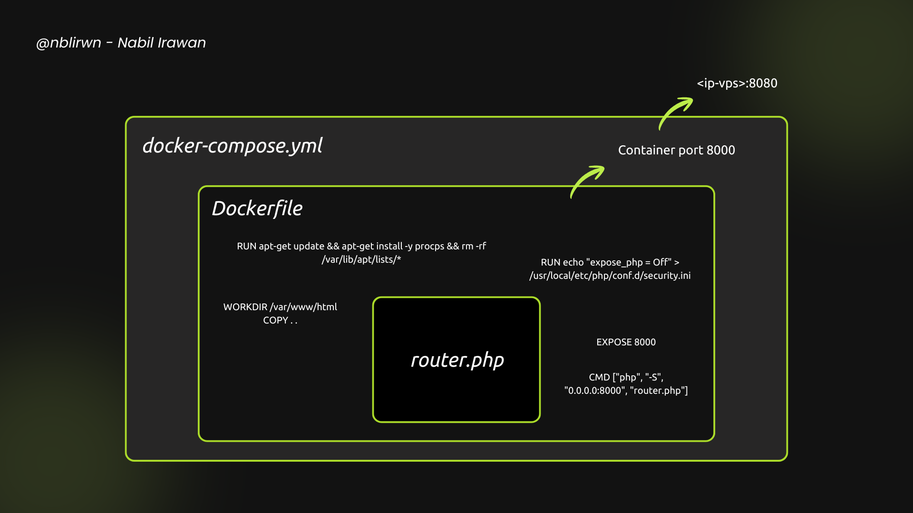

  Dir: `api/`

  Asumsinya VPS telah ter-install Docker. Pada poin 2 diminta untuk mengimplementasikan deployment pada VPS publik. Di sini yang digunakan adalah `router.php`, `Dockerfile`, dan `docker-compose.yml`. `Dockerfile` mengambil image linux yang sudah ter-install php8.2, kemudian melakukan setup hingga menyalakan server PHP dalam container pada port 8000. Kemudian `docker-compose.yml` read `Dockerfile` dan build image baru dengan memberi nama containernya php_health_api, setelah itu menyambungkan port container server PHP dengan port 8080 agar dapat diakses melalui \<ip-vps\>:8080. Dengan menggunakan `restart: unless-stopped`, seharusnya ketika server crash atau vps restart, `docker-compose.yml` akan otomatis menghidupkan container.

- Implementasi Security

  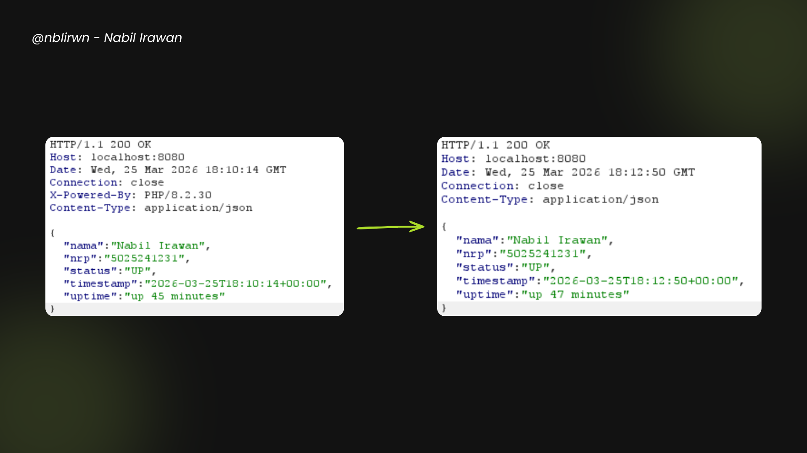

  Terdapat implementasi minimal untuk Security. Dengan menggunakan `RUN echo "expose_php = Off" > /usr/local/etc/php/conf.d/security.ini` pada `Dockerfile`, maka akan menghapus Response Header `X-Powered-By` yang umumnya ditandai oleh attacker untuk mengumpulkan informasi hingga melakukan penyerangan pada teknologi yang digunakan server.

- Reference
  - https://hub.docker.com/layers/library/php/8.2-cli
  - https://gemini.google.com/share/3303a4dbb6aa
  - https://stackoverflow.com/questions/9617579/turning-expose-php-off-in-php-ini

<br>

## Poin 3

> Gunakan Ansible untuk menginstall dan meletakkan konfigurasi nginx pada VPS. Nginx akan berperan sebagai reverse proxy yang meneruskan request ke API. Sehingga, API harus bisa diakses hanya dengan menjalankan Ansible Playbook tanpa intervensi/konfigurasi nginx secara manual.

**Answer:**

- Screenshot

  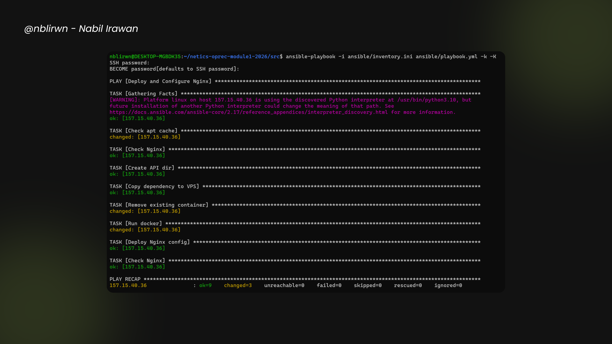

- Explanation

  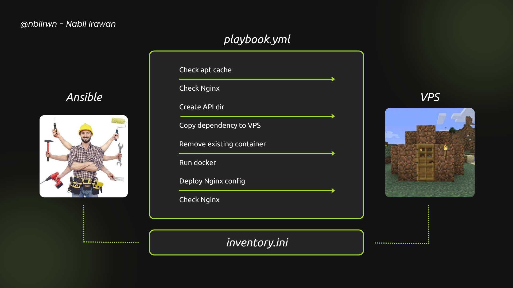

  Dir: `ansible/`

  Pada poin 3 diminta untuk konfigurasi nginx menggunakan Ansible. Terdapat `inventory.ini` yang berfungsi untuk memetakan alamat IP VPS dan user yang digunakan oleh Ansible pada VPS, `playbook.yml` yang digunakan sebagai instruksi kerja "Deploy and Configure Nginx", mulai dari `Check apt cache` hingga `Deploy Nginx config` beserta handlernya, dan `templates/nginx.conf.j2` yang berisi konfigurasi Nginx. Sehingga ketika ada client yang mengakses server port 80, maka akan di-passing ke port 8080.

  Validasi: `ansible-playbook -i ansible/inventory.ini ansible/playbook.yml -k -K`

  (membutuhkan pkg `sshpass` dan akan diminta ssh password)

- Implementasi Security

  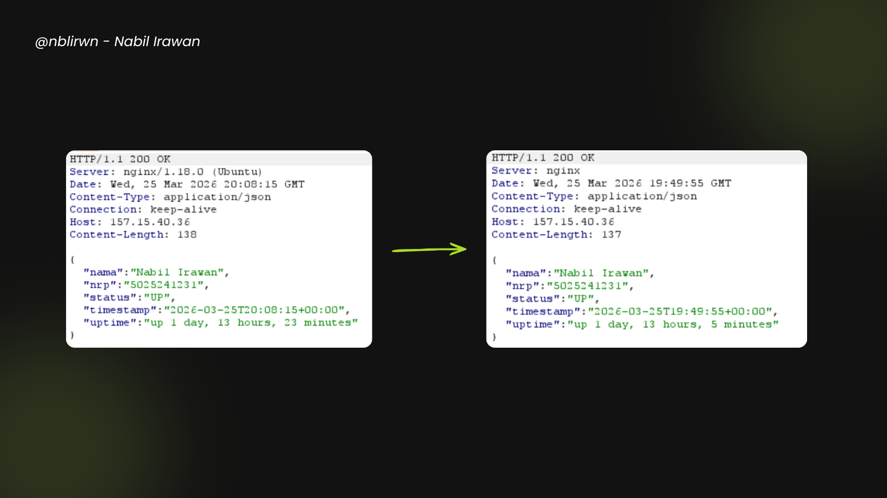

  Terdapat implementasi minimal untuk Security. Dengan menggunakan `server_tokens off;` pada `templates/nginx.conf.j2`, maka akan menyembunyikan versi Nginx yang umumnya ditandai oleh attacker untuk mengumpulkan informasi hingga melakukan penyerangan pada teknologi yang digunakan server.

- Reference
  - https://symfonycasts.com/screencast/ansible/nginx-conf-template
  - https://pigsty.io/docs/setup/playbook/
  - https://serverfault.com/questions/214242/can-i-hide-all-server-os-info
  - https://gemini.google.com/share/3303a4dbb6aa

<br>

## Poin 4

> Lakukan proses CI/CD menggunakan GitHub Actions untuk melakukan otomasi proses deployment API. Terapkan juga best practices untuk menjaga kualitas environment CI/CD.

**Answer:**

- Screenshot

  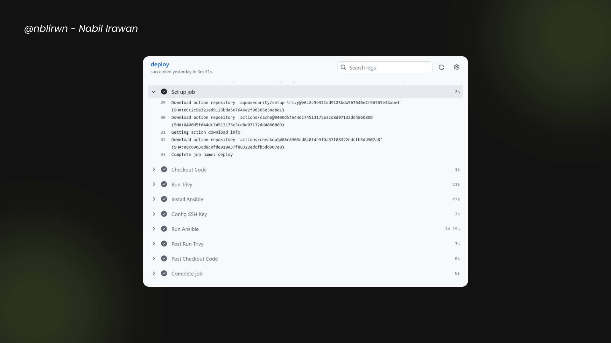

- Explanation

  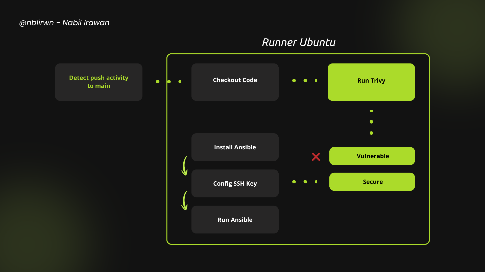

  Dir: `.github/workflows/`

  Asumsinya telah menyiapkan Repository secrets VPS_SSH_KEY, VPS_USERNAME, dan VPS_HOST.

  Mendapatkan VPS_SSH_KEY:
  ```
  local:
  ssh-keygen -t rsa -b 4096 -f ~/.ssh/github_actions_key -C "cicd-key"
  ssh-copy-id -i ~/.ssh/github_actions_key.pub root@<ip-vps>
  cat ~/.ssh/github_actions_key
  ```

  Pada Poin 4 diminta untuk mengimplementasikan CI/CD menggunakan Github Actions. `deploy.yml` merupakan panduan untuk bot worker Github Actions. Ketika mendeteksi adanya aktivitas push ke branch main, maka akan spawn virtual runner menggunakan Ubuntu versi terbaru, kemudian melakukan job yang tertera pada `deploy.yml`, mulai dari `Checkout Code` hingga `Run Ansible`.

- Implementasi Security

  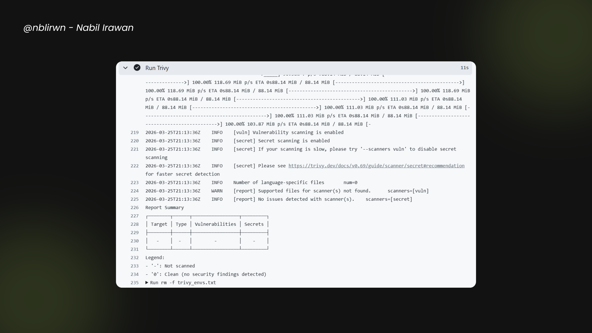

  Terdapat implementasi minimal untuk Security. Pada CI/CD Pipeline terdapat `Run Trivy` yang melakukan scan ke seluruh filesystem. Jika ditemukan adanya vulnerability dengan severity CRITICAL atau HIGH dan sudah ada patch mengenai vulnerability tersebut, maka proses akan dihentikan. Namun jika tidak ditemukan, maka proses akan dilanjutkan hingga selesai. Hal ini merupakan implementasi sederhana untuk mencegah adanya vulnerability yang lolos ke production.

- Reference
  - https://gemini.google.com/share/3303a4dbb6aa
  - https://github.com/aquasecurity/trivy
  - https://stackoverflow.com/questions/60477061/github-actions-how-to-deploy-to-remote-server-using-ssh